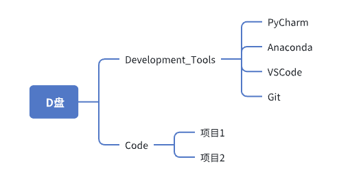

# 初次了解（第一周10月9日-10月10日）

本周学习目标：

1. 掌握如何管理开发工具和项目代码的目录
2. 安装一些开发软件
3. 了解主流框架

### 1、目录管理

D盘下创建文件夹Development_Tools和文件夹Code,前者专门放用于开发的软件,后者专门放项目的代码,
具体名字可以不一样。如下即可:

其中PyCharm、Anaconda、项目1是根据安装的软件和后面项目决定的，不用手动创建。

 ### 2、安装软件

安装PyCharm、VSCode、Python(版本3.12左右即可,如果会Anacondla就不用下python了)

### 3、了解主流框架

了解主流的后端框架:SpringBoot、Django。从下面表格给出的内容情况了解即可

| 前后端框架         | 就业、薪资情况 | 使用该技术的网页或公司 | 学习难度 | 需要的前置技术和知识 |
| ------------------ | -------------- | ---------------------- | -------- | -------------------- |
| SpringBoot         |                |                        |          |                      |
| Django             |                |                        |          |                      |
| Vue                |                |                        |          |                      |
| React              |                |                        |          |                      |
| 如有兴趣了解其他的 |                |                        |          |                      |

