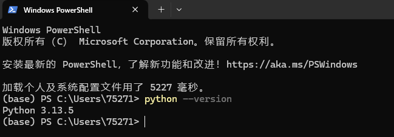
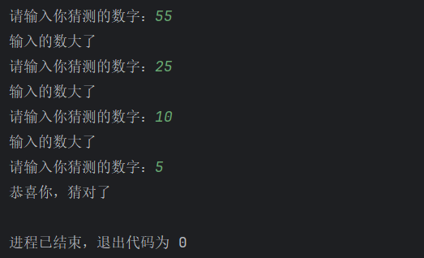

# 初始python(第二周)

## 学习任务

1. 了解python编程语言，并安装python环境。
2. 了解python解释器、python开发环境，并安装Pycharm作为开发工具(推荐)，用pycharm创建一个python项目。
3. 书写第一个python程序，要求：程序可以读取用户输入，然后输出你好！*****。 *为用户输入类容。
4. 学习python的基础语言：变量、数据类型（整数、浮点数、字符串、布尔值）、运算符、注释。
5. 学习python的流程控制：条件语句、循环语句
6. 练习：写一个猜数字游戏。程序在运行时会随机生成一个1-100以内数字，让用户一直输入数字，同时提示用户输入的与答案比是大还是小，用户输入正确后退出游戏。（注意：随机数了解random，如果使用input接受用户输入，记得将值转换为整数类型）

## 参考：

1、

2、

3、

6、

