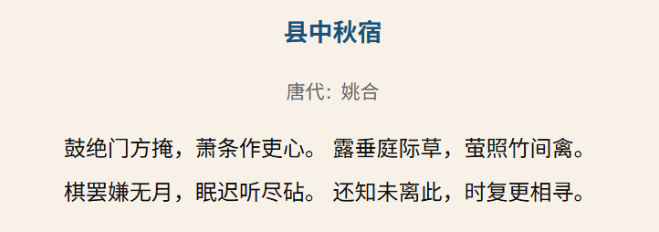
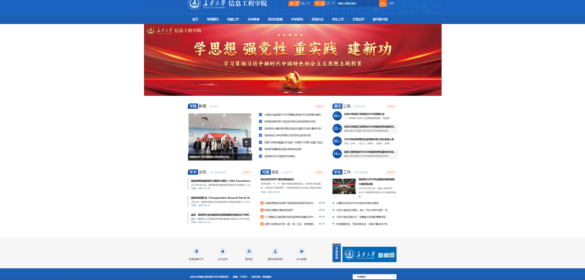

# CSS 选择器和字体样式(第四周)

## 学习任务
1. 了解CSS是什么，主要用来干什么的。

2. 根据CSS的书写位置，可以分为几类。

3. 学习文本样式（字体样式：颜色、字体、倾斜、加粗、装饰；文本布局：对齐、缩进、间距、行高），便于后续学习选择器。

4. 学习CSS选择器，基础选择器，关系选择器，伪类选择器，每种选择器都有很多分类。

5. 练习1：古诗词，html部分使用p标签、h标签就可以完成，css部分使用文本样式。

    古诗词参考网站：[古诗词网](https://www.gushici.net/)

    要求：字体、颜色相同，鼠标悬停在诗句上时的效果相同（如悬停时字体变红）。

6. 练习2：画盒子，将[信息工程学院官网](https://it.chd.edu.cn/)按块划分，如head、nav、main、footer标签来组织页面。
