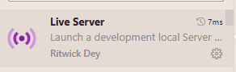
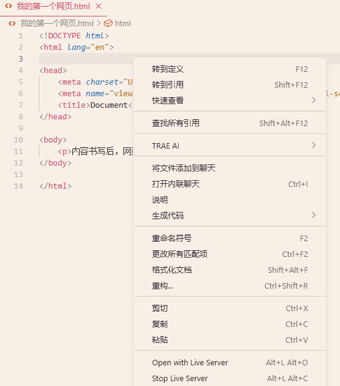
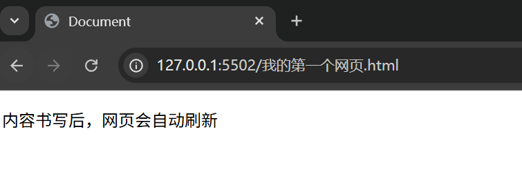
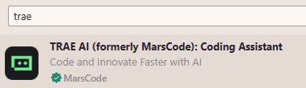
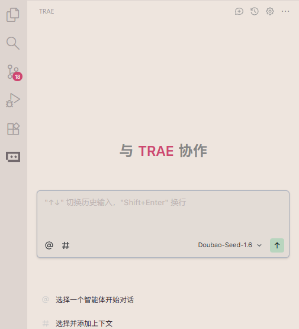
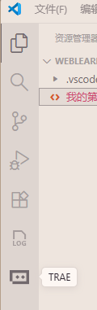

# 额外扩展

# VSCode 插件推荐

### 目录

[1.Live Server](#1)

[2.Trae AI](#2)

## 1、Live Server
在左侧扩展商店处搜索 Live Server 并安装

使用方法：打开html文件，右键选择open with Live Server

此时会使用默认浏览器打开：

出现127.0.0.1:550x 说明插件下载成功，此时在html文件上更改内容后，网页会实时刷新。

## 2、Trae AI (国内版Cursor)

使用方法：快捷键 Ctrl+U 唤起对话

或点击左侧侧边栏的按钮：

