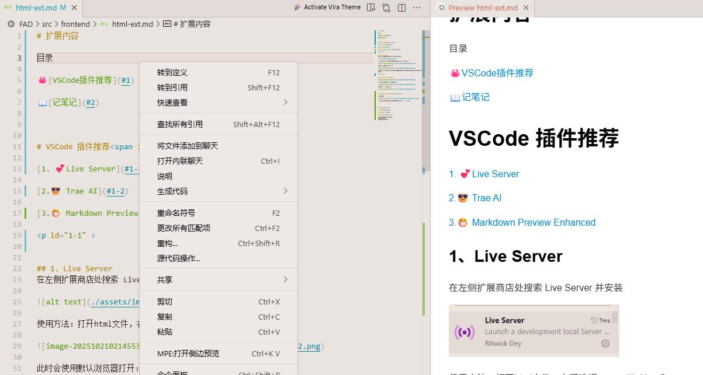
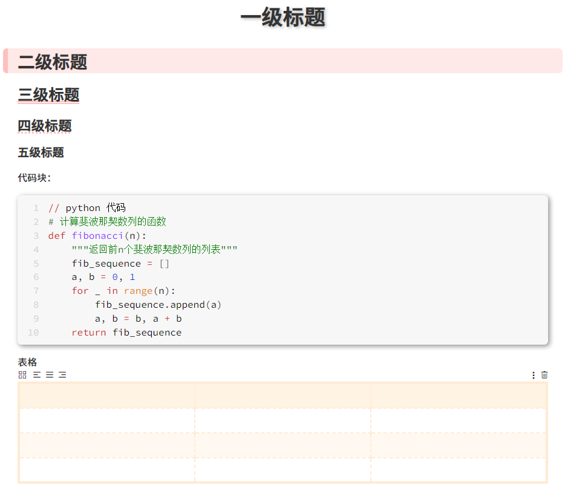
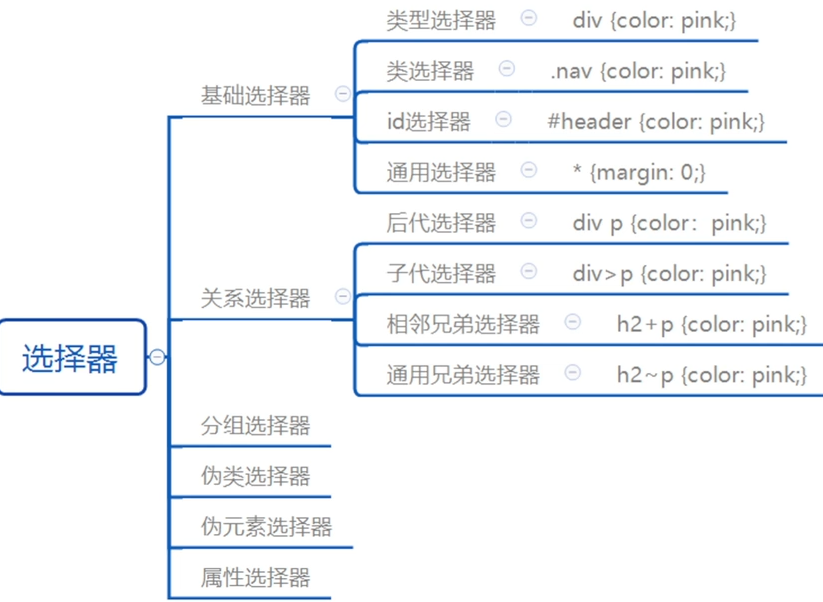

# 扩展内容

目录

🦀[VSCode插件推荐](#1)

📖[记笔记](#2)

# VSCode 插件推荐

[1. 💕Live Server](#1-1)

[2.😎 Trae AI](#1-2)

[3.😁 Markdown Preview Enhanced](#1-3)

## 1、Live Server
在左侧扩展商店处搜索 Live Server 并安装

使用方法：打开html文件，右键选择open with Live Server

此时会使用默认浏览器打开：

出现127.0.0.1:550x 说明插件下载成功，此时在html文件上更改内容后，网页会实时刷新。

## 2、Trae AI (国内版Cursor)

使用方法：快捷键 Ctrl+U 唤起对话

或点击左侧侧边栏的按钮：

## 3、Markdown Preview Enhanced

插件搜索：

使用方法：在Markdown(.md)文件右键选择`MPE:打开侧边栏预览`

# 记笔记

[1. 💕Markdown](#2-1)

[2.😎思维导图 ](#2-2)

## Markdown

Markdown 是一种**轻量级标记语言**。它的核心目标是让人们能够使用“易于阅读、易于编写”的纯文本格式来写作，然后可以轻松地转换成结构化的 HTML 或其它富文本格式。

示例：

常用软件：Typora、VSCode

Typora破解包:[飞书下载](https://wcn6gmfkzss8.feishu.cn/file/UGgSbQwPuowccRx1sekcyWqAnuh)

VsCode:下载插件[Markdown Preview Enhanced](#1-3)

## 思维导图
示例：

XMind软件：[飞书下载](https://wcn6gmfkzss8.feishu.cn/file/Q8NlbrHDqo3AhnxccsacgMpWnpf?from=from_copylink) 

飞书使用方法：文档空白处可以插入

